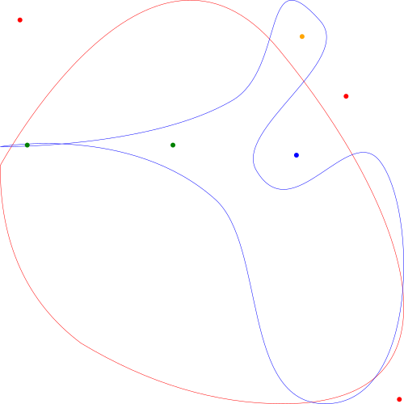

# point-in-svg-polygon - Determine if an point is inside a polygon

[](https://travis-ci.org/rubenv/point-in-svg-polygon)

Works with arbitrary polygons (as in: curves!).

## What it does

Given an SVG path and a point, it'll tell you whether the point lies within the SVG path.

For instance:



Color  | Inside red shape (convex)? | Inside blue shape (concave)?
------ | -------------------------- | ----------------------------
Red    | No                         | No
Green  | Yes                        | Yes
Blue   | Yes                        | No
Orange | No                         | Yes

## Usage

Give it a point and a path string:

```js
var pointInSvgPolygon = require("point-in-svg-polygon");

// See the path specification for the correct format
// https://developer.mozilla.org/en/docs/Web/SVG/Tutorial/Paths
var pathString = "M1,1 C1,1 501,1 501,501 C501,1001 1,1001 1,1001 L1,1 Z";
var result = pointInSvgPolygon.isInside([x, y], pathString);
```

You can amortize the path splitting by performing it once:

```js
var pointInSvgPolygon = require("point-in-svg-polygon");

// See the path specification for the correct format
// https://developer.mozilla.org/en/docs/Web/SVG/Tutorial/Paths
var pathString = "M1,1 C1,1 501,1 501,501 C501,1001 1,1001 1,1001 L1,1 Z";
var segments = pointInSvgPolygon.segments(pathString);

// Use it multiple times:
var result = pointInSvgPolygon.isInside([x, y], segments);
```

This is useful if you have to test a lot of points.

## Credits

Originally based on the work by Kevin Lindsey. Severly trimmed down: 3Kb
footprint when minified, drops down to 1.5Kb when gzipped.

## License 

    Copyright (c) 2016, Ruben Vermeersch
    Copyright (c) 2013, Kevin Lindsey
    All rights reserved.

    Redistribution and use in source and binary forms, with or without modification,
    are permitted provided that the following conditions are met:

      Redistributions of source code must retain the above copyright notice, this
      list of conditions and the following disclaimer.

      Redistributions in binary form must reproduce the above copyright notice, this
      list of conditions and the following disclaimer in the documentation and/or
      other materials provided with the distribution.

      Neither the name of the {organization} nor the names of its
      contributors may be used to endorse or promote products derived from
      this software without specific prior written permission.

    THIS SOFTWARE IS PROVIDED BY THE COPYRIGHT HOLDERS AND CONTRIBUTORS "AS IS" AND
    ANY EXPRESS OR IMPLIED WARRANTIES, INCLUDING, BUT NOT LIMITED TO, THE IMPLIED
    WARRANTIES OF MERCHANTABILITY AND FITNESS FOR A PARTICULAR PURPOSE ARE
    DISCLAIMED. IN NO EVENT SHALL THE COPYRIGHT HOLDER OR CONTRIBUTORS BE LIABLE FOR
    ANY DIRECT, INDIRECT, INCIDENTAL, SPECIAL, EXEMPLARY, OR CONSEQUENTIAL DAMAGES
    (INCLUDING, BUT NOT LIMITED TO, PROCUREMENT OF SUBSTITUTE GOODS OR SERVICES;
    LOSS OF USE, DATA, OR PROFITS; OR BUSINESS INTERRUPTION) HOWEVER CAUSED AND ON
    ANY THEORY OF LIABILITY, WHETHER IN CONTRACT, STRICT LIABILITY, OR TORT
    (INCLUDING NEGLIGENCE OR OTHERWISE) ARISING IN ANY WAY OUT OF THE USE OF THIS
    SOFTWARE, EVEN IF ADVISED OF THE POSSIBILITY OF SUCH DAMAGE.
